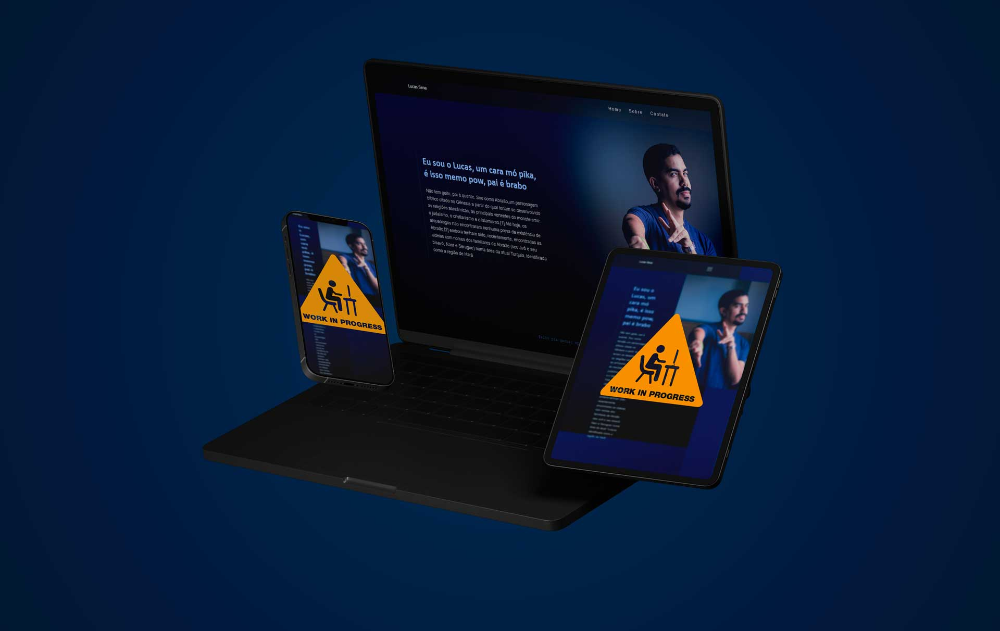

# lucas-page (in-progress) 🙅‍♂️⚠

uma página completamente autoral, feita para my friend lucas, como uma forma de botar em prática meus estudos.

   

## O que tenho até agora 08/06 📆

Até agora eu tenho a configuração padrão de um novo progeto com o vite, e alguns encapsulamentos do react como o header, footer e o home.

Além disso eu fiz algo bem legal Home usando duas fotos, um efeito em css que eu tive a ideia e foi bem difícil de implementar mas eu achei incrível 

   

## Tecnologias 🧪

- react ⚛
- vite ⚡
- TypeScript 📝
- css puro, sem frame works 🛠
